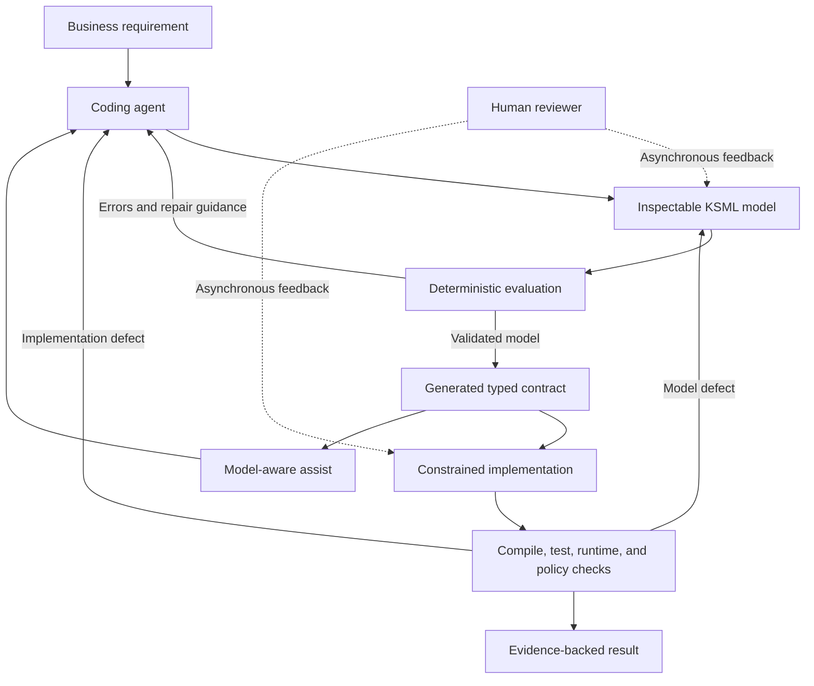
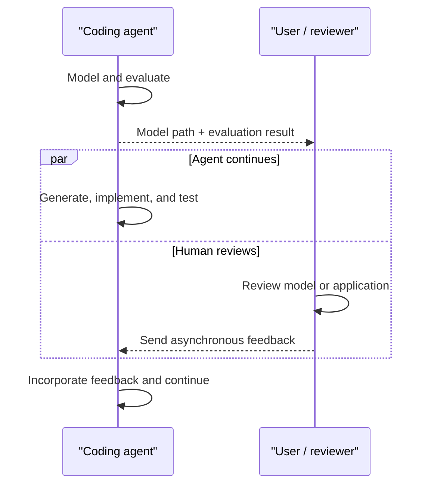

# TeaQL Agent Kit

> A model-mediated harness for reliable agentic software development.

TeaQL Agent Kit demonstrates a new harness pattern for coding agents. Instead
of letting an agent move directly from requirements to implementation, it
places an executable domain model between intent and code.

The model becomes an inspectable intermediate representation. A deterministic
evaluation service checks it and provides repair guidance. Generation turns
the validated model into a typed API boundary, while model-aware assist teaches
the agent the exact API available for the current domain.

The goal is not deterministic AI. It is deterministic structure around
non-deterministic AI.

**Correct-by-process, governed-by-runtime.** TeaQL governs both how software is
produced and how it behaves when it runs.

## Two Layers of Reliability

TeaQL applies constraints at two different times.

### Do Things Right: Development-time Process

The Agent Kit controls how a coding agent moves from requirement to working
software: model first, evaluate and repair, generate a typed contract, request
current model-aware assist, implement within that contract, and verify the
result with evidence.

### Do the Right Thing: Runtime Governance

The TeaQL runtime controls how the resulting application acts: operations
carry identity and intent, reads declare purpose and comment, writes declare
an audit reason, external capabilities are explicitly granted, and typed
entity graphs constrain mutation.

Runtime governance does not choose the correct business policy. It makes
application actions contextual, bounded, observable, and auditable once that
policy has been chosen.

## What This Repository Introduces

Most coding agents operate in a prompt-to-code loop:

```text
requirement → agent → code → test → repair
```

TeaQL inserts a model-mediated control layer:

```text
requirement
    ↓
inspectable domain model
    ↓
deterministic evaluation and repair
    ↓
generated typed contract
    ↓
constrained agent implementation
    ↓
compile, test, runtime, and audit evidence
```

This changes the role of the agent. The agent no longer invents the domain
contract, persistence surface, and business logic at the same time. It models
intent first, works against a generated contract, and demonstrates completion
with concrete evidence.

TeaQL Agent Kit is therefore not merely a code-generation Skill. It is a
reference implementation of a model-mediated harness for coding agents.

## The Harness Pattern



The harness has five cooperating parts:

1. **Inspectable intermediate representation** — KSML turns business intent
   into a saved artifact that agents, tools, and people can inspect and revise.
2. **Deterministic feedback oracle** — model evaluation returns errors,
   warnings, suggestions, and current repair guidance instead of relying on the
   agent to memorize a large rule catalog.
3. **Generated action boundary** — typed domain APIs and model-aware assist
   narrow the implementation surface and reduce API invention.
4. **Policy-bearing APIs** — identity context, query purpose, query comments,
   and write audits travel with execution rather than remaining prompt advice.
5. **Evidence-based completion** — evaluation, generated guidance, policy
   checks, compilation, tests, and runtime results form a traceable evidence
   chain from requirement to application.

These constraints do not make an agent infallible. They make its actions
smaller, more observable, and easier to review.

## Where the Harness Lives

The repository publishes the harness as focused Agent Skills:

- [`SKILL.md`](skills/build-teaql-app/SKILL.md) defines the mandatory
  model-first execution order and agent constraints.
- [`model-teaql-from-datahub`](skills/model-teaql-from-datahub/SKILL.md)
  grounds an initial or evolving KSML model in existing DataHub schemas,
  classifications, glossary terms, and relationships while recording facts,
  inferences, and framework additions separately.
- [`golden-example.xml`](skills/build-teaql-app/references/golden-example.xml)
  provides a compact grammar example without loading a full rule catalog.
- [`toolchains.md`](skills/build-teaql-app/references/toolchains.md) binds the
  workflow to versioned clients, evaluation, generation, and model-aware
  assist.
- [`work-complete.md`](skills/build-teaql-app/references/work-complete.md)
  defines the evidence required before the agent reports completion.

Together, these artifacts coordinate the agent, the model evaluator, generated
contracts, runtime policies, verification tools, and parallel human review.

## Explore the Live Harness

The live Generation Service presents the same model-mediated path as a guided,
five-stage walkthrough:

[Walk through the live TeaQL harness](https://api.teaql.io/latest/)

1. Turn a business requirement into a saved KSML domain contract.
2. Inspect the model as an interactive entity graph or data dictionary.
3. Evaluate the model, repair reported Errors, and retain the report as
   evidence.
4. Generate stable domain libraries and separate editable Java or Rust
   application workspaces.
5. Develop against the generated contract with model-, language-, action-, and
   object-specific assist.

The page also exposes a live evaluation report, generation target catalog,
workspace API guides, and side-by-side Java and Rust previews for create,
update, query, list, expression, delete, debugging, granted tool API, and
runtime customization guidance.

This live surface demonstrates that the evaluator, generators, typed
contracts, and just-in-time assist are concrete parts of the harness rather
than conventions described only in a prompt. The `/latest/` endpoint follows
the current published demo and may evolve with the service.

## Install the Agent Skill

Install the complete model-to-application workflow with the community Skills
CLI:

```bash
npx skills add teaql/teaql-agent-kit --skill build-teaql-app
```

Then ask your coding agent:

```text
Use $build-teaql-app to first draft and save a complete KSML model, then
evaluate and repair it before generating a runnable TeaQL application: ...
```

This repository can publish multiple focused Skills. `build-teaql-app` is the
end-to-end workflow: model, evaluate, generate, implement, verify, and report.

When enterprise context already exists in DataHub, install the grounding Skill
as well:

```bash
npx skills add teaql/teaql-agent-kit --skill model-teaql-from-datahub
```

Then provide dataset URNs or another resolvable DataHub locator:

```text
Use $model-teaql-from-datahub to ground the TeaQL model in these existing
DataHub datasets, record facts and inferences, and then continue with
$build-teaql-app: ...
```

## From Business Intent to Typed Contract

A compact KSML model describes business objects, fields, constants,
relationships, modules, and storage:

```xml
<root cfg_mask_china_mobile="false"
      data_service="sqlite"
      name="bookstore-service"
      org="example"
      _module_key="root">
  <bookstore _name="Bookstore"
             _module="Organization"
             _module_key="organization"
             name="TeaQL Books"/>
  <book _name="Book"
        _module="Catalog"
        _module_key="catalog"
        title="Domain Modeling with TeaQL"
        bookstore="bookstore()"/>
</root>
```

The Generation Service turns the validated model into entities, relation
metadata, typed queries, null-safe expressions, graph persistence, checker and
behavior hooks, repository registration, documentation, and a runnable
application workspace.

Application code then reads in domain language rather than generic ORM
plumbing:

```rust
let merchants = Q::merchants()
    .select_name()
    .which_names_contain("tea")
    .purpose("Find merchants for search results")
    .comment("Search merchant names")
    .execute_for_list(&ctx)
    .await?;
```

The generated domain library is a model-derived contract and remains
regenerable. Business logic stays in a separate editable application workspace.

## Continuous Agent Work, Parallel Human Review

After modeling and evaluation, the agent sends a compact signal:

```text
Model Ready
- Model: /path/to/project/models/model.xml
- Evaluation: passed — 0 errors, 2 warnings, 1 suggestion
```

The path lets a person open and review the actual model. The notification does
not stop execution: the agent continues generating, implementing, testing, and
repairing the application.

Human review happens alongside that work. A reviewer can inspect the model or
running application at any time and send feedback asynchronously. If feedback
changes the domain contract, the agent updates the model, evaluates it again,
regenerates, and continues.



Review is a parallel activity, not a waiting node.

## Runtime Safeguards

TeaQL constrains how agents interact with business data:

1. **Mandatory identity** — operations pass through `UserContext`, making
   identity and request scope explicit.
2. **Intent auditing** — reads declare their purpose and comment; writes carry
   an audit description.
3. **Capability sandbox** — HTTP, file access, messaging, and similar tools are
   explicitly granted rather than ambient.
4. **Graph mutability control** — typed entity graphs replace manually
   coordinated SQL updates and relationship loops.
5. **Semantic error translation** — infrastructure failures can become stable,
   actionable application errors.

## Runnable Examples and Harness Evidence

The Agent Kit defines the shared harness pattern. Runnable applications remain
in language-specific repositories so their toolchains, dependencies, and
release cycles can evolve independently:

- [TeaQL Java App Examples](https://github.com/teaql/teaql-java-app-examples)
- [TeaQL Rust App Examples](https://github.com/teaql/teaql-rust-app-examples)

| Example | Application surface | Harness behavior demonstrated |
| --- | --- | --- |
| [Java Robot Task Board](https://github.com/teaql/teaql-java-app-examples/tree/main/001-robot-task-board-android) | Local Android application | Model-derived typed CRUD, query purpose and comment, audited writes, and visible SQL execution logs |
| [Java Vending Machine Desktop](https://github.com/teaql/teaql-java-app-examples/tree/main/002-vending-machine-compose-desktop) | Compose Desktop and SQLite | A generated domain library embedded in a local desktop application |
| [Java World Cup CLI](https://github.com/teaql/teaql-java-app-examples/tree/main/003-world-cpu-2006-cli) | Interactive CLI and SQLite | Declarative domain modeling, generated query and entity APIs, relational queries, and audited persistence |
| [Java Vending Machine](https://github.com/teaql/teaql-java-app-examples/tree/main/005-vending-machine-web-spring-boot) | Spring Boot, [Quarkus](https://github.com/teaql/teaql-java-app-examples/tree/main/006-vending-machine-web-quarkus), and [Micronaut](https://github.com/teaql/teaql-java-app-examples/tree/main/007-vending-machine-web-micronaut) | One modeled domain hosted across multiple Java application frameworks |
| [Rust World Cup CLI](https://github.com/teaql/teaql-rust-app-examples/tree/main/001-world-cpu-2006-cli) and [TUI](https://github.com/teaql/teaql-rust-app-examples/tree/main/002-world-cup-2006-tui) | Interactive CLI, TUI, and SQLite | Model-to-generated-library separation, typed `Q` and `E` APIs, and audited graph persistence |
| [Rust Linux System Info](https://github.com/teaql/teaql-rust-app-examples/tree/main/003-linux-sysinfo-using-teaql) | Linux `/proc` provider and console UI | A generated typed query boundary applied to an operating-system capability rather than a conventional database |

These examples provide runnable application and code evidence. An end-to-end
recording can complement them with agent-execution evidence: the initial model,
evaluation and repair rounds, generated assist, policy checks, compilation,
tests, and runtime results.

## Java and Rust Foundations

TeaQL Agent Kit builds on the open-source
[teaql-java](https://github.com/teaql/teaql-java) and
[teaql-rs](https://github.com/teaql/teaql-rs) runtimes.

| Area | TeaQL Java | TeaQL Rust |
| --- | --- | --- |
| Strength | Mature modular runtime across server, console, desktop, and Android | Rust-native typed runtime focused on query compilation and relation graphs |
| Queries | Typed requests, policies, relations, aggregation, and JSON queries | Query AST, SQL compilation, aggregation, subqueries, and nested relation loading |
| Mutations | Audited entity and graph persistence | Transactional graph planning, nested graph diff, optimistic locking, delete, and recover |
| Extension | Replaceable policies, stores, locks, translators, tools, and framework integrations | Runtime modules, behaviors, checkers, mutation events, typed resources, and memory execution |
| Databases | Broad portable SQL and database support | Native PostgreSQL, SQLite, MySQL, and rusqlite providers |

The implementations differ in breadth and maturity while sharing the same
model-first, typed, and auditable programming approach.

## TeaQL Generation Service

The Generation Service provides the most complete model-derived output set:

- Java and Rust typed domain libraries
- Editable application workspaces
- Model evaluation and repair guidance
- Object-specific query, create, update, delete, and expression assist
- Runtime and tool guides generated for the current domain
- Data-design, model-view, and frontend model outputs

### Open-source Rust generation

Developers who want to inspect or extend an open-source generation service
written in Rust can explore
[teaql-forge-rs](https://github.com/teaql/teaql-forge-rs). Forge is a small open
implementation and does not claim full feature parity with the TeaQL Generation
Service.

## Explore the Kit

- [Build TeaQL App Skill](skills/build-teaql-app/SKILL.md)
- [Model TeaQL from DataHub Skill](skills/model-teaql-from-datahub/SKILL.md)
- [TeaQL Java runtime](https://github.com/teaql/teaql-java)
- [TeaQL Rust runtime](https://github.com/teaql/teaql-rs)
- [Open-source Rust generator](https://github.com/teaql/teaql-forge-rs)
- [TeaQL](https://teaql.io)

## License

TeaQL Agent Kit is available under the [MIT License](LICENSE).
