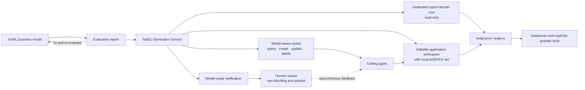
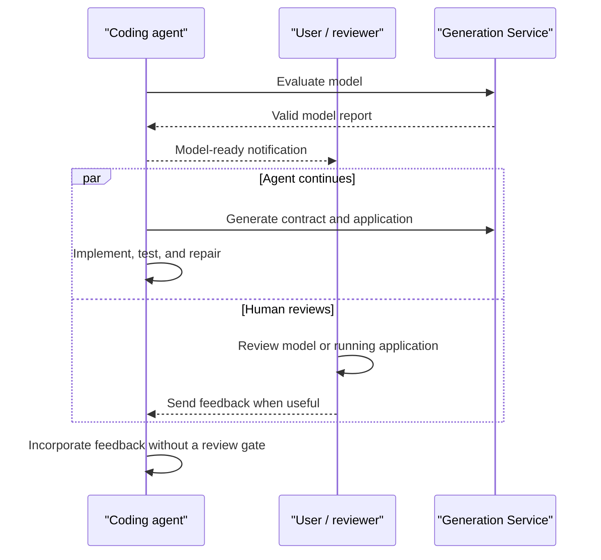

# TeaQL Agent Kit

> Deterministic execution for non-deterministic AI.

TeaQL Agent Kit helps coding agents turn compact business models into auditable
Java and Rust applications. It connects agents to a model-aware **TeaQL
Generation Service**, gives them generated and typed domain APIs, and runs the
result inside capability-oriented TeaQL runtimes.

The result is a much smaller solution space for an agent: model the business,
validate it, generate the contract, ask for the exact API, and implement only
the business logic that belongs in the editable application layer.

> [!NOTE]
> AI agents should use [`AGENTS.md`](AGENTS.md), not this README, as their
> execution guide. This README is the product overview for human readers.

## From Business Model to Running Application



A small KSML model is enough to describe business objects, fields, constants,
relationships, modules, and storage:

```xml
<root alias_model_name="bookstore_management"
      chinese_name="书店管理"
      english_name="Bookstore Management"
      name="bookstore-service"
      data_service="sqlite"
      org="doublechaintech"
      _module_key="root">
  <bookstore name="TeaQL Books"
             create_time="createTime()"
             update_time="updateTime()"/>
  <book title="Domain Modeling with TeaQL"
        bookstore="bookstore()"
        create_time="createTime()"
        update_time="updateTime()"/>
</root>
```

The Generation Service turns that model into entities, relation metadata,
typed query builders, null-safe expressions, graph-save entrypoints, checker
and behavior hooks, repository registration, documentation, and an editable
application workspace.

Application code works against generated domain language rather than generic
ORM plumbing:

```rust
let merchants = Q::merchants()
    .select_name()
    .which_names_contain("tea")
    .purpose("Find matching merchants for search results")
    .comment("Search enabled merchant names")
    .execute_for_list(&ctx)
    .await?;
```

The exact methods come from the current model. Agents retrieve them through
object-specific assist instead of guessing.

## Continuous Execution, Parallel Review

TeaQL does not treat review as a mode switch or a mandatory waiting point.
After a model passes evaluation, the agent publishes a concise model summary,
notifies the user that it is ready, and continues with generation,
implementation, and verification.

Human review happens alongside that work:



The notification creates visibility; it does not request permission to
continue. A reviewer can inspect the model, generated application, or live
effect at any time and send feedback asynchronously. If that feedback changes
the domain contract, the agent updates the model, regenerates, and keeps
working.

## Why TeaQL Is Built for Coding Agents

Most application frameworks give an agent a large collection of loosely
related APIs and trust it to assemble them correctly. TeaQL takes the opposite
approach: it generates a narrow domain contract and requires operations to
carry identity, intent, and audit information.

### Model-aware generation

The model is the source of truth. Repetitive domain and persistence APIs are
generated consistently for Java and Rust, while customer-owned business logic
stays in a separate editable workspace.

### Machine-readable feedback

Model evaluation returns Markdown reports containing errors, warnings,
suggestions, repeated error patterns, and concrete repair guidance. Agents can
fix the model and immediately evaluate it again instead of searching through
unrelated framework source.

### Exact, on-demand assist

Assist content is generated from the same model as the code:

```bash
cargo teaql --input model.xml rust-assist-query merchant
cargo teaql --input model.xml rust-assist-update merchant
cargo teaql --input model.xml java-assist-create order
```

Query, create, update, delete, expression, list-page, debug, runtime, and tool
guidance can be requested for the object currently being implemented. This
reduces hallucinated APIs and unnecessary context.

### Generated local instructions

Editable application outputs include a project-specific `AGENTS.md`, object
names, supported assist actions, and focused runtime/tool guides. Guidance
travels with the generated contract.

## The Five Safeguards of AI Coding

The Java and Rust runtimes share a common safety model:

1. **Mandatory identity** — every operation passes through `UserContext`, so
   identity and request-scoped resources are explicit.
2. **Intent auditing** — reads declare `.purpose()` and `.comment()`; writes
   declare `.auditAs()` in Java or `.audit_as()` in Rust.
3. **Capability sandbox** — tools such as HTTP, file access, or messaging are
   optional capabilities rather than ambient authority.
4. **Graph mutability control** — agents work with typed entity graphs through
   `saveGraph` or `save_graph` instead of manually coordinating SQL updates and
   relationship loops.
5. **Semantic error translation** — runtime failures can be translated into
   stable, actionable application errors instead of exposing agents to endless
   infrastructure stack-trace loops.

These constraints do not make an agent infallible. They make its actions
smaller, more observable, and easier to review.

## Runtime Foundations

TeaQL Agent Kit builds on two open-source runtime implementations:
[teaql-java](https://github.com/teaql/teaql-java) and
[teaql-rs](https://github.com/teaql/teaql-rs).

| Area | TeaQL Java | TeaQL Rust |
| --- | --- | --- |
| Primary strength | Mature, modular runtime across server, console, desktop, and Android environments | Rust-native typed runtime focused on query compilation, relation graphs, and explicit runtime assembly |
| Queries | Typed requests, criteria, policies, relation loading, aggregation, and JSON query support | Query AST, projections, filters, grouping, aggregates, subqueries, relation loading, and SQL compilation |
| Mutations | Audited entity and graph persistence | Transactional graph planning, nested graph diff, optimistic locking, soft delete, and recover |
| Runtime extension | Replaceable policies, data stores, locks, translators, tools, and framework integrations | `RuntimeModule`, repository behaviors, checkers, mutation events, typed resources, and in-memory execution |
| Database reach | SQLite, MySQL, PostgreSQL, Oracle, DB2, SQL Server, HANA, DuckDB, Snowflake, DM8, and portable SQL | Native PostgreSQL, SQLite, MySQL, and synchronous rusqlite providers |
| Additional capabilities | Dynamic fields, explicit Jackson integration, portable SQL, Spring Boot, Quarkus, Micronaut, and Android paths | Derive macros, safe expressions, graph mutation plans, schema bootstrap, framework-neutral web payloads, and Excel block models |

The runtimes deliberately differ in breadth and maturity. The Agent Kit exposes
their shared programming model while keeping stack-specific guidance explicit.

## What the Generation Service Produces

The TeaQL Generation Service currently provides the richest model-derived
output set.

| Target or capability | Result |
| --- | --- |
| `evaluate` | Markdown model-quality report with repair guidance |
| `java-lib-core` | Generated Java domain library, metadata, repositories, requests, expressions, checkers, validators, constants, and GraphQL descriptors |
| Java application targets | Editable Spring Boot, Quarkus, Micronaut, or console workspace derived from the model |
| `rust-lib-core` | Generated Rust domain crate with entities, requests, expressions, behaviors, checkers, graph-save entrypoints, and runtime registration |
| `rust-app-console` | Editable Tokio application that depends on the generated Rust domain crate |
| `java-assist-*` / `rust-assist-*` | Model- and object-specific implementation guidance |
| Documentation outputs | Data design, model views, merged frontend model, and local runtime/tool guides |

Generated core output is disposable and regenerated from the model. Business
logic belongs in the editable application workspace, never in generated files.

### Open-source Rust generation

The TeaQL Generation Service remains the most feature-rich implementation.
For developers who want to inspect or extend a small open-source generation
service written in Rust, see
[teaql-forge-rs](https://github.com/teaql/teaql-forge-rs). Forge is an open
implementation, not a claim of full target parity with the hosted service.

## Five-minute Rust Path

This repository requires `cargo-teaql` exactly `2.0.10`.

```bash
cargo install cargo-teaql --version 2.0.10 --force
cargo-teaql --version
cargo-teaql install-links
```

No additional API-key discovery or configuration is required for the standard
CLI flow; the out-of-the-box free-tier configuration is sufficient.

Place the model under `app-playground/models`, then evaluate it:

```bash
cargo teaql --input app-playground/models/model.xml evaluate
```

Generate the read-only Rust domain crate and the editable application
separately:

```bash
cargo teaql --input app-playground/models/model.xml rust-lib-core \
  --output app-playground/rust-lib-core \
  --cwd app-playground

cargo teaql --input app-playground/models/model.xml rust-app-console \
  --output app-playground/rust-app-console \
  --cwd app-playground
```

Then read the generated application guide before writing business logic:

```text
app-playground/
  models/             # source-of-truth KSML
  rust-lib-core/      # generated domain/runtime code; do not edit
  rust-app-console/   # editable application and tests
    AGENTS.md         # project-specific agent contract
```

For multi-file models, pass the complete model directory to `--input` rather
than uploading `main.xml` alone. See the
[five-minute agent guide](agents/QUICK-START.md) for the complete workflow.

## Execution Guides

This repository is intentionally organized as focused context rather than one
large manual:

- [`modeling/KSML-RULES.md`](modeling/KSML-RULES.md) — canonical KSML rules
- [`agents/QUICK-START.md`](agents/QUICK-START.md) — shortest safe path from
  model to application
- [`agents/TEMPLATES.md`](agents/TEMPLATES.md) — copyable modeling patterns
- [`agents/DECISION-TREES.md`](agents/DECISION-TREES.md) — root, tenancy, and
  modeling decisions
- [`agents/ERROR-FIX.md`](agents/ERROR-FIX.md) — targeted repair patterns
- [`playbooks/generate-with-toolchains.md`](playbooks/generate-with-toolchains.md)
  — Java and Rust generation workflow
- [`playbooks/model-from-natural-language.md`](playbooks/model-from-natural-language.md)
  — turning requirements into a domain model

## Evaluation and Evidence

The `main` branch supports continuous autonomous execution with optional,
parallel human review. Separate controlled and autonomous branch modes are not
required: review is an asynchronous activity, not an execution checkpoint.

Runs can still be evaluated for functional completion, compile and test
results, API adherence, hallucinated API count, audit coverage, framework
discipline, error recovery, human feedback, token usage, and unsafe shortcuts.

Evidence is preserved under `runs/<agent>/<task-id>/<run-date>/` and scored
with [`evaluation/scorecard-template.md`](evaluation/scorecard-template.md).

## Long-term Direction

TeaQL is working toward measured automation:

1. Generate a narrow, typed business capability surface.
2. Require identity, intent, and audit context at execution time.
3. Give agents exact, model-derived guidance only when needed.
4. Notify people at meaningful milestones without stopping execution.
5. Run agent implementation and human review concurrently.
6. Incorporate feedback, evaluate behavior, and preserve evidence.

The goal is not to make non-deterministic models appear deterministic. It is to
make the software they produce and operate constrained, auditable, and
reviewable.

[teaql.io](https://teaql.io)
