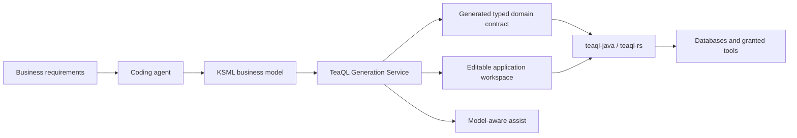
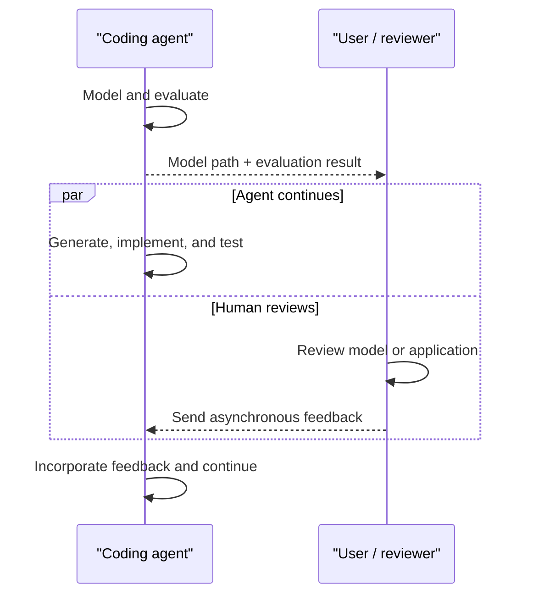

# TeaQL Agent Kit

> Deterministic execution for non-deterministic AI.

TeaQL Agent Kit helps coding agents turn business requirements into auditable
Java and Rust applications.

Instead of asking an agent to invent persistence code from scratch, TeaQL gives
it a smaller and safer path: build a business model, evaluate it, generate a
typed domain contract, and implement business logic against that contract.

## What TeaQL Does



A compact KSML model describes business objects, fields, constants,
relationships, modules, and storage:

```xml
<root alias_model_name="bookstore_management"
      cfg_mask_china_mobile="false"
      chinese_name="书店管理"
      english_name="Bookstore Management"
      data_service="sqlite"
      name="bookstore-service"
      org="doublechaintech"
      _module_key="root">
  <bookstore name="TeaQL Books"/>
  <book title="Domain Modeling with TeaQL"
        bookstore="bookstore()"/>
</root>
```

The Generation Service turns the model into entities, relation metadata, typed
queries, null-safe expressions, graph persistence, checker and behavior hooks,
repository registration, documentation, and a runnable application workspace.

Application code then reads in domain language rather than generic ORM
plumbing:

```rust
let merchants = Q::merchants()
    .select_name()
    .which_names_contain("tea")
    .purpose("Find merchants for search results")
    .comment("Search merchant names")
    .execute_for_list(&ctx)
    .await?;
```

## Continuous Agent Work, Parallel Human Review

After modeling and evaluation, the agent sends a compact signal:

```text
Model Ready
- Model: /path/to/project/models/model.xml
- Evaluation: passed — 0 errors, 2 warnings, 1 suggestion
```

The path lets a person open and review the actual model. The notification does
not stop execution: the agent continues generating, implementing, testing, and
repairing the application.

Human review happens alongside that work. A reviewer can inspect the model or
running application at any time and send feedback asynchronously. If feedback
changes the domain contract, the agent updates the model, evaluates it again,
regenerates, and continues.



Review is a parallel activity, not a waiting node.

## Safeguards for AI Coding

TeaQL constrains how agents interact with business data:

1. **Mandatory identity** — operations pass through `UserContext`, making
   identity and request scope explicit.
2. **Intent auditing** — reads declare their purpose and comment; writes carry
   an audit description.
3. **Capability sandbox** — HTTP, file access, messaging, and similar tools are
   explicitly granted rather than ambient.
4. **Graph mutability control** — typed entity graphs replace manually
   coordinated SQL updates and relationship loops.
5. **Semantic error translation** — infrastructure failures can become stable,
   actionable application errors.

These constraints do not make an agent infallible. They make its actions
smaller, more observable, and easier to review.

## Java and Rust Foundations

TeaQL Agent Kit builds on the open-source
[teaql-java](https://github.com/teaql/teaql-java) and
[teaql-rs](https://github.com/teaql/teaql-rs) runtimes.

| Area | TeaQL Java | TeaQL Rust |
| --- | --- | --- |
| Strength | Mature modular runtime across server, console, desktop, and Android | Rust-native typed runtime focused on query compilation and relation graphs |
| Queries | Typed requests, policies, relations, aggregation, and JSON queries | Query AST, SQL compilation, aggregation, subqueries, and nested relation loading |
| Mutations | Audited entity and graph persistence | Transactional graph planning, nested graph diff, optimistic locking, delete, and recover |
| Extension | Replaceable policies, stores, locks, translators, tools, and framework integrations | Runtime modules, behaviors, checkers, mutation events, typed resources, and memory execution |
| Databases | Broad portable SQL and database support | Native PostgreSQL, SQLite, MySQL, and rusqlite providers |

The implementations differ in breadth and maturity while sharing the same
model-first, typed, and auditable programming approach.

## TeaQL Generation Service

The Generation Service provides the most complete model-derived output set:

- Java and Rust typed domain libraries
- Editable application workspaces
- Model evaluation and repair guidance
- Object-specific query, create, update, delete, and expression assist
- Runtime and tool guides generated for the current domain
- Data-design, model-view, and frontend model outputs

Generated domain libraries are regenerated from the model. Customer business
logic stays in a separate editable application workspace.

### Open-source Rust generation

Developers who want to inspect or extend an open-source generation service
written in Rust can explore
[teaql-forge-rs](https://github.com/teaql/teaql-forge-rs). Forge is a small open
implementation and does not claim full feature parity with the TeaQL Generation
Service.

## Explore the Kit

- [KSML modeling rules](modeling/KSML-RULES.md)
- [Five-minute agent workflow](agents/QUICK-START.md)
- [Modeling templates](agents/TEMPLATES.md)
- [Error repair patterns](agents/ERROR-FIX.md)
- [Java and Rust generation playbook](playbooks/generate-with-toolchains.md)
- [Natural-language modeling playbook](playbooks/model-from-natural-language.md)

[teaql.io](https://teaql.io)
